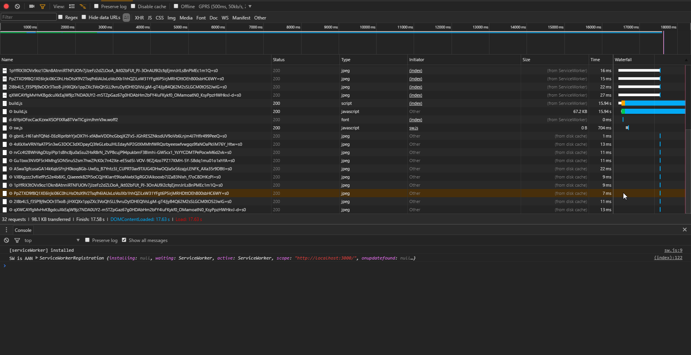
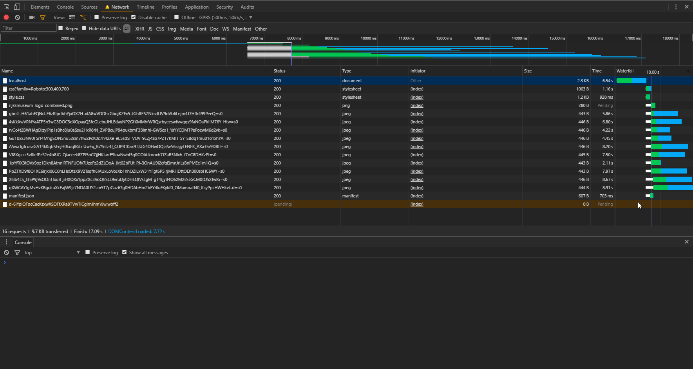
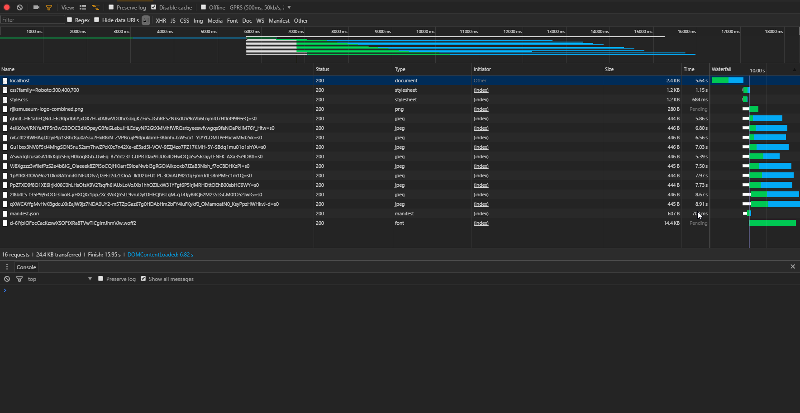

# Performance matters - (web-app-from-scratch - nodeJS version)

## repo for performance matters 

### About
This repo is a server side version of [this assignment](https://github.com/olli208/web-app-from-scratch). Using expressroutes.js I tried to make a minimal version of that app. 

The app works offline after the page loads once. With the help of a Service Worker we make it possible to serve cached pages (previosly visited) to the user without an internet connection.

#### Job Stories
- When I am on a vacation, I want to be able to see artPieces, even with no connection.
- When I have no connection, I want the app to tell me which art Pieces I have access to, So that I can check them out.
- When I have no connection, I want be warned by the app, so I know that the app has limited functionality.

### Run the App
When you have [NODE](https://nodejs.org/en/) & [NPM](https://www.npmjs.com/) on your computer run the following command:
```
npm start
```
Then go to 
> http://localhost:3000/

### Build
To build run the following command:
```
npm run build
```
[Browserfy](http://browserify.org/) makes a build.js file with all the dependencies needed.

## Performance optimizations
Tested with GPRS(500ms, 50kb/s) 

#### Without any optimizations

> Finish: 17.58s || DOMContentLoaded: 17.63s

### Gzip
An easy optimization is enabling gzip in the sever.js file using a module [compression](https://www.npmjs.com/package/compression).

#### With Gzip

> Finish: 17.09s || DOMContentLoaded: 7.72s

### Critical CSS 
Generated via [criticalpathcssgenerator](https://jonassebastianohlsson.com/criticalpathcssgenerator/). Which makes te head look like:
```
<head>
    ...

    <title>Single Page Web App</title>

    <!--Critical CSS: -->
    <style>
        *{padding:0;margin:0;box-sizing:border-box;font-family:Roboto,sans-serif}body{width:100%;display:flex;flex-direction:column;background:#5f9ea0}
    </style>

    ...
</head>
```

#### With Critical CSS

> Finish: 15.95s || DOMContentLoaded: 6.82s

> The critical path is the path to render a web page - what's needed before that can happen. CSS Stylesheets block rendering. Until the browser has requested, received, downloaded and parsed your stylesheets, the page will remain blank. By reducing the amount of CSS the browser has to go through, and by inlining it on the page (removing the HTTP request), we can get the page to render much, much faster.
- Jonasse Bastian Ohlsson


## Sources 
- [una](https://una.im/save-offline/#%F0%9F%92%81)
- [How to Setup a Basic Service Worker (with Caching](https://www.youtube.com/watch?v=BfL3pprhnms)
- [
Replacing The User Story With The Job Story](https://jtbd.info/replacing-the-user-story-with-the-job-story-af7cdee10c27)


TO DO:
- 
